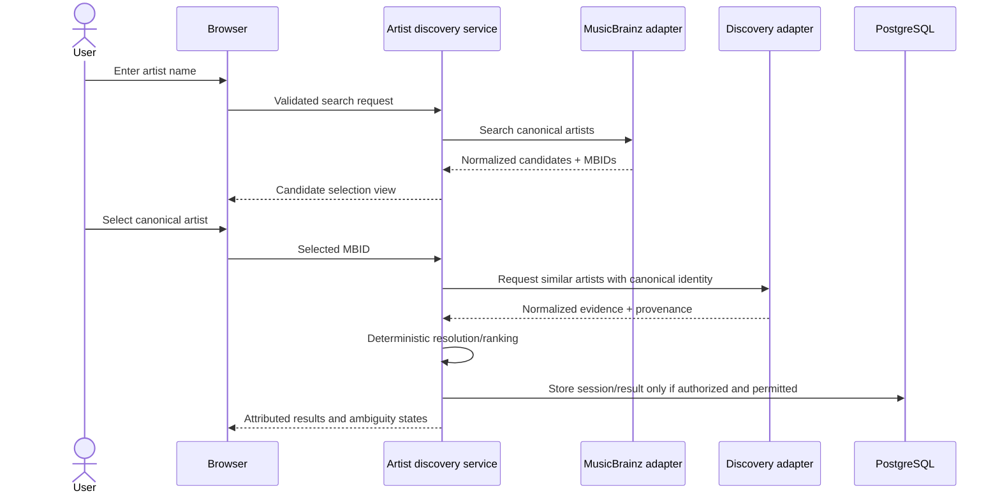
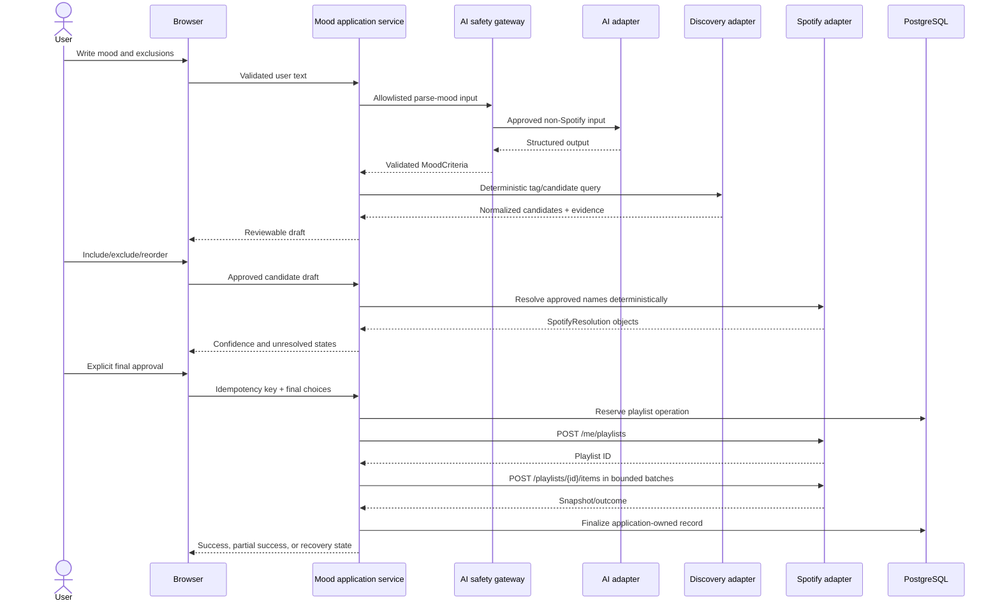
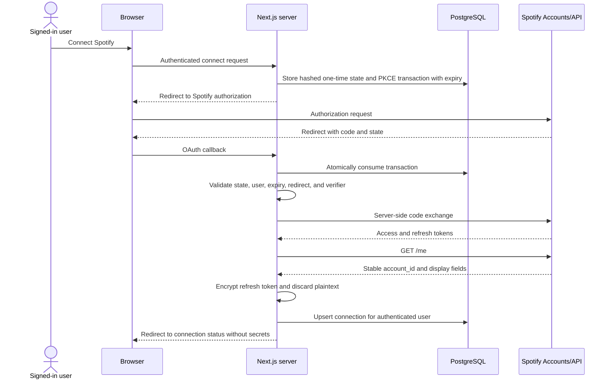

# CrateCompass Data Flow

Status: Phase 0 baseline  
Last reviewed: 2026-08-02

## Trust zones

| Zone | Trust level | Examples |
| --- | --- | --- |
| Browser | Untrusted input and display environment | Forms, cookies, UI state, public configuration |
| Next.js server | Trusted application boundary | Validation, authorization, orchestration, provider calls |
| Supabase | Trusted identity/data system with policy enforcement | Auth, PostgreSQL, RLS |
| Provider adapters | Trusted code handling untrusted external responses | MusicBrainz, Last.fm, Spotify, AI adapters |
| External providers | Independent third parties | Their APIs and data-processing environments |
| Observability | Sensitive operational sink | Redacted logs, metrics, alerts |

All transitions into the server, database, or domain model are validated. External responses are untrusted even when authenticated.

## Canonical artist discovery

An explanation request follows a separate path. The AI input builder receives only user preferences, canonical MusicBrainz identity, and terms-approved normalized discovery evidence. It cannot receive a later Spotify resolution.

## Mood discovery and playlist creation

The Spotify resolution occurs after all AI calls needed to parse the mood and generate candidate-language content. Playlist titles/descriptions are generated before Spotify resolution from user text and application criteria only, or by deterministic templates.

## Spotify OAuth connection

OAuth codes, verifier values, state material, access tokens, and plaintext refresh tokens are never sent to logs or Client Components. An OAuth callback cannot create an application user or link a connection to a different session.

## Token refresh

1. A server operation locks or atomically selects the active connection.
2. It verifies `disconnected_at` is null and the token version is supported.
3. It decrypts the refresh token only in memory.
4. It calls Spotify's token endpoint server-side.
5. It handles token rotation by encrypting and atomically replacing a returned refresh token.
6. It updates refresh metadata and clears plaintext values from references.
7. A revoked/invalid token marks the connection as requiring reauthorization.
8. Concurrent refreshes do not overwrite a newer rotated token.

## Discography Q&A

```mermaid
flowchart LR
    Q["User question + selected MBID"] --> V["Input validation and authorization"]
    V --> M["MusicBrainz retrieval"]
    M --> N["Bounded normalized fact set"]
    N --> G["AI allowlist gateway"]
    G --> A["AI provider"]
    A --> Z["Structured answer validation"]
    Z --> C["Reference completeness check"]
    C --> R["Answer or honest insufficient-context state"]
```

The persisted conversation stores user-visible content and source references. It does not store raw MusicBrainz payloads or hidden AI reasoning.

## Save and history flow

- The authenticated user ID comes from the server session, not a request field.
- Input schemas allow only supported entity and provider types.
- Upserts use explicit conflict keys owned by the same user.
- RLS independently checks ownership.
- Provider identifiers are stored only where needed for retrieval, linking, or attribution.
- Deleting history does not delete an externally created Spotify playlist; the UI explains this distinction.

## Disconnect and deletion

### Spotify disconnect

1. Require an authenticated user and CSRF/same-origin protection.
2. Mark the connection disconnected atomically so refresh logic stops immediately.
3. Attempt provider revocation where Spotify supports the applicable operation; failure does not preserve local credential usability.
4. Destroy refresh-token ciphertext and record a non-secret audit event.
5. Keep only the minimum disconnected-account audit metadata for the documented retention period, or delete the row.

### CrateCompass account deletion

1. Require recent authentication and explicit typed or equivalent confirmation.
2. Mark deletion in progress to prevent new mutations.
3. Destroy all Spotify token material first.
4. Delete user-owned records via foreign-key cascades or a reviewed database function.
5. Delete the Supabase Auth user through a narrow server-only administrative operation.
6. Return a verifiable completion result; retry idempotently after partial failure.

## Observability flow

Every request obtains a correlation ID. Structured events can include route, operation, provider, duration, outcome, retry count, validation code, and quota reason. A centralized redactor removes headers, cookies, secrets, tokens, OAuth parameters, full user text, and raw provider bodies before emission. Security-boundary rejections emit metadata about the rule, never the rejected value.

## Data retention classes

| Class | Examples | Planned retention |
| --- | --- | --- |
| Required account data | Profile and settings | Until deletion or replacement |
| Connected-account secret | Encrypted refresh token | Until disconnect, revocation, rotation, or account deletion |
| User library | Favorites, notes, generated-playlist record | Until user deletion |
| User history | Discovery sessions and conversations | User-controlled; final default to be approved before launch |
| Operational security | Redacted audit events | Short, documented period based on incident need |
| Provider cache | Permitted normalized lookup results | Provider-policy TTL only |
| Ephemeral | Access token, OAuth state/verifier, raw responses | In-memory or short-lived transaction lifetime only |

Retention periods that are not yet contractually or operationally known are decision gates, not invented values.

## Failure and recovery states

- **MusicBrainz unavailable:** canonical search/discography is unavailable; do not substitute another identity silently.
- **Discovery provider unavailable:** show the canonical artist but no recommendations; permit retry.
- **AI unavailable:** preserve deterministic discovery and use a factual template only when the template has sufficient evidence.
- **Spotify unavailable/disconnected:** preserve candidate review and save the draft; disable playlist creation with recovery guidance.
- **Playlist partially created:** persist external playlist ID and operation state, expose retry/repair, and do not create duplicates.
- **Database unavailable:** do not claim a save succeeded; avoid performing an external mutation unless recovery state can be persisted safely.

