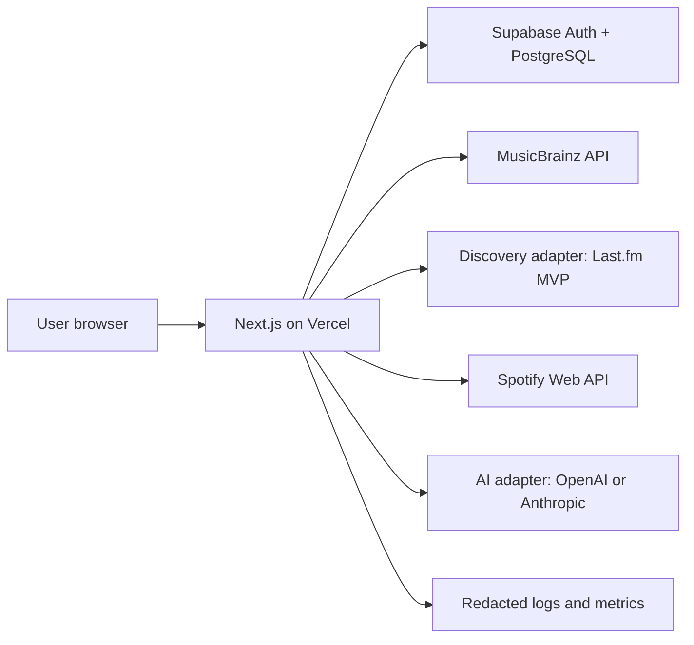

# CrateCompass System Architecture

Status: Phase 0 baseline  
Last reviewed: 2026-08-02

## Architectural goals

The architecture prioritizes provider isolation, verifiable provenance, least privilege, graceful degradation, and an enforceable prohibition on Spotify content entering an AI system. Next.js is the application boundary, Supabase is the identity and persistence authority, MusicBrainz is the canonical music authority, Last.fm is the initial discovery source, and Spotify is an optional fulfillment integration.

## Runtime context



Only trusted server modules call external providers. Client Components receive purpose-built view models, never provider credentials or raw privileged responses.

## Major components

### Presentation layer

- Next.js App Router layouts and pages.
- Server Components for authenticated reads and initial rendering.
- Client Components only for interactions requiring browser state.
- Accessible design-system primitives and explicit provider states.
- TanStack Query only for client-side server state that benefits from background synchronization.

### Application layer

Feature-oriented services coordinate use cases:

- `features/auth`
- `features/artist-discovery`
- `features/mood-discovery`
- `features/playlists`
- `features/discography`
- `features/library`
- `features/history`
- `features/settings`

Application services consume normalized domain objects and ports. They do not import raw provider response types.

### Domain layer

Application-owned types include:

- `CanonicalArtist`
- `ArtistCandidate`
- `SimilarityEvidence`
- `DiscographyRelease`
- `MoodCriteria`
- `TrackCandidate`
- `SpotifyResolution`
- `SavedDiscovery`
- `PlaylistDraft`
- `ProviderProvenance`

Provenance is explicit and non-optional on external facts. Spotify-derived models use nominal/opaque typing and are never assignable to AI-safe inputs.

### Provider layer

Server-only adapters live below `lib/providers` and own:

- Provider request/response schemas.
- Authentication and secret access.
- Timeout, retry, quota, and rate-limit behavior.
- Error normalization.
- Mapping to domain types.
- Attribution and provenance.

No provider adapter imports another provider adapter. Cross-provider orchestration belongs to application services.

### Persistence layer

- Supabase Auth establishes `auth.uid()`.
- PostgreSQL stores application-owned records.
- RLS is mandatory for all user-owned tables.
- Browser clients use only the publishable/anonymous Supabase key and RLS-protected operations.
- Service-role access is restricted to narrow server-only administrative paths.
- Spotify refresh-token ciphertext is inaccessible through ordinary browser-facing database APIs.

## Initial directory design

```text
app/
  (marketing)/
  (auth)/
  (app)/
  api/
components/
  ui/
  layout/
features/
  auth/
  artist-discovery/
  mood-discovery/
  playlists/
  discography/
  library/
  history/
  settings/
lib/
  ai/
  observability/
  providers/
    musicbrainz/
    discovery/
    spotify/
  security/
  supabase/
  validation/
types/
tests/
  unit/
  integration/
  contract/
  security/
  e2e/
supabase/
  migrations/
docs/
```

This is a planning target, not Phase 0 implementation.

## Server and client boundaries

### Server-only

- Provider API keys and AI model configuration.
- Spotify client secret, OAuth transaction state, code verifier, token exchange, refresh, and revocation.
- Token encryption and decryption.
- Supabase service-role key.
- Raw provider responses.
- AI input construction and adapter calls.
- Playlist creation and database writes requiring trusted orchestration.

Server-only modules will use explicit `server-only` guards and must not be re-exported from shared barrels.

### Client-safe

- Public Supabase URL and publishable key.
- Public application URL and non-secret feature flags.
- Validated view models containing only fields needed by the UI.
- Spotify display data only when its attribution and link requirements are satisfied.

## Application interaction patterns

- Prefer Server Components for reads that can occur during rendering.
- Use Route Handlers for OAuth callbacks, external web-style endpoints, streaming, and stable API contracts.
- Use Server Actions for authenticated form mutations only when their lifecycle and CSRF posture are appropriate.
- Validate every boundary with Zod and return normalized problem details.
- Require idempotency keys for playlist creation and retryable destructive operations.
- Do not make provider calls directly from the browser.

## Provider resilience

Each provider call defines:

- A bounded timeout.
- Whether it is safe to retry.
- Maximum attempts with jittered exponential backoff.
- Handling for 401, 403, 404, 429, 5xx, malformed data, and network failure.
- Cache eligibility and retention based on provider terms.
- A circuit/open-state or temporary-unavailable response where repeated failures would amplify an outage.

Spotify 429 handling distinguishes `QUOTA_EXCEEDED` from ordinary rolling-window rate limiting and honors `Retry-After` when supplied. MusicBrainz requests are centrally paced to no more than one request per second per outbound application/IP unless a separate agreement applies and include a meaningful User-Agent.

## Caching strategy

- Cache normalized MusicBrainz and discovery results only as permitted by their licenses and response headers.
- Include provider, schema version, retrieval time, and expiry in cache keys/records.
- Cache Spotify search resolution only briefly when operationally necessary.
- Never persist raw Spotify API payloads or download/rehost Spotify artwork.
- Invalidate or allow expiry rather than treating cached provider data as canonical forever.
- Do not cache AI input containing sensitive user text beyond the minimum operational need.

## AI architecture

The product depends on an `AIProvider` port with these methods:

```ts
interface AIProvider {
  parseMood(input: ParseMoodInput): Promise<MoodCriteria>;
  explainArtistMatch(input: ExplainArtistMatchInput): Promise<ArtistMatchExplanation>;
  answerDiscographyQuestion(
    input: DiscographyQuestionInput,
  ): Promise<DiscographyAnswer>;
  generatePlaylistTitle(input: PlaylistNamingInput): Promise<PlaylistTitle>;
  generatePlaylistDescription(
    input: PlaylistNamingInput,
  ): Promise<PlaylistDescription>;
}
```

All input types are allowlisted application models. The AI gateway rejects forbidden keys, Spotify provenance, Spotify hosts/URIs, credential patterns, and unknown properties before serialization. All outputs are parsed against strict Zod schemas. Model names and active provider are environment-configurable.

## Authentication architecture

- Supabase email/password Auth establishes the application session in secure cookies compatible with App Router server rendering.
- Middleware/proxy logic refreshes sessions without being the sole authorization layer.
- Server-side data access revalidates the authenticated user.
- Spotify OAuth is linked to an existing Supabase user.
- Spotify account linking uses the immutable `account_id` returned by current `GET /me` responses.
- Authorization Code with PKCE, exact redirect matching, state, and one-time transaction records protect the flow.

## Deployment architecture

- Vercel hosts the Next.js application.
- Supabase hosts Auth and PostgreSQL with migration-driven changes.
- Preview environments use isolated or explicitly non-production provider configuration.
- Production secrets are stored in platform secret management, never repository files.
- Migrations run in a controlled deployment step, not automatically from request handlers.
- Deployment requires a passing production build and automated quality/security gates.

## Architecture decision records to add later

Phase implementation should add focused ADRs for:

1. Package manager and runtime versions.
2. Supabase SSR session pattern.
3. Refresh-token encryption and key rotation.
4. Discovery-provider selection after terms approval.
5. AI SDK and structured-output implementation.
6. Rate limiting and idempotency store.
7. Background job strategy if account deletion or playlist recovery requires it.

## Current external references

- Spotify Developer Policy: <https://developer.spotify.com/policy>
- Spotify February 2026 migration guide: <https://developer.spotify.com/documentation/web-api/tutorials/february-2026-migration-guide>
- Spotify July 2026 quota update: <https://developer.spotify.com/blog/2026-07-23-web-api-quota-updates>
- MusicBrainz API: <https://musicbrainz.org/doc/MusicBrainz_API>
- Last.fm API: <https://www.last.fm/api>
- ListenBrainz API: <https://listenbrainz.readthedocs.io/en/latest/users/api/index.html>

